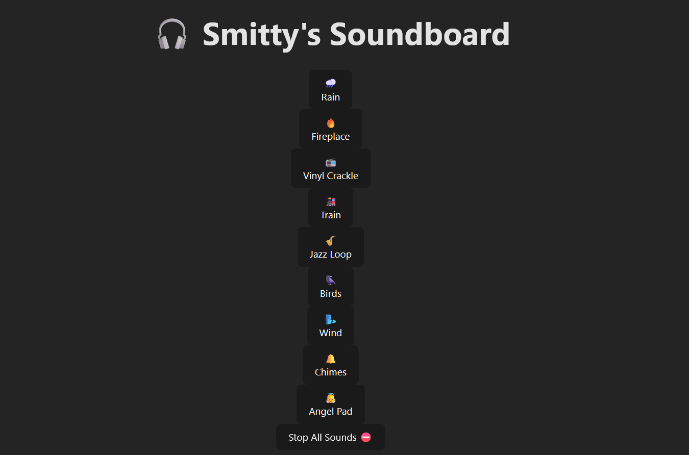

# 🎧 Smitty's Lo-Fi Soundboard

A chill, browser-based lo-fi ambient soundboard built with **React**, **Vite**, and **Howler.js**.  
Click to mix ambient loops like rain, fire, vinyl crackle, and birds — with per-sound volume controls and a “chill combo” preset.



---

## 🚀 Features

- 🌧️ Play multiple ambient loops at once  
- 🔊 Per-sound vertical volume sliders  
- ⛔ Stop All button  
- 🌈 Mobile-optimized layout  
- 🍏 iOS-safe audio unlock (fixes autoplay issues on iPhones)  
- 📦 Deploy-ready on [Vercel](https://vercel.com)

---

## 🛠️ Stack

- [React](https://reactjs.org/)
- [Vite](https://vitejs.dev/)
- [Howler.js](https://github.com/goldfire/howler.js)
- [Tailwind CSS](https://tailwindcss.com/)

---

## 📦 Installation

```bash
git clone https://github.com/dylanrsmith/soundboard.git
cd soundboard
npm install
npm run dev
```

App will be live at [http://localhost:5173](http://localhost:5173)

---

## 🔊 Adding Sounds

Drop `.mp3` files into the `/public/sounds/` folder and update the `sounds` array in `LoFiSoundboard.jsx`:

```js
const sounds = [
  { name: 'Rain', emoji: '🌧️', url: '/sounds/rain.mp3' },
  // Add more here
];
```

---

## 🌍 Deployment

This project is auto-deployed to Vercel.

To manually build and preview locally:

```bash
npm run build
npm run preview
```

To deploy to Vercel:

```bash
vercel --prod
```

---

## 📱 iOS Audio Unlock

iPhones require user interaction to unlock Web Audio.  
This app plays a silent `silence.mp3` on first tap to enable sound playback safely across all platforms.

Place it at:  
```
/public/sounds/silence.mp3
```

---

## 🧠 Author

Built by [@dylanrsmith](https://github.com/dylanrsmith)  
Inspired by late-night YouTube lo-fi streams

---

## 📄 License

MIT
